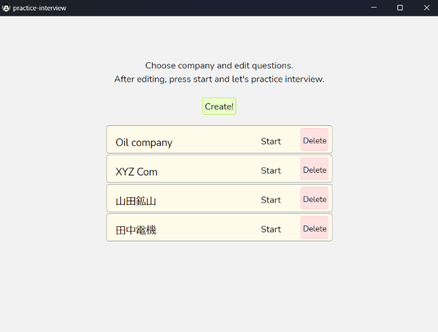
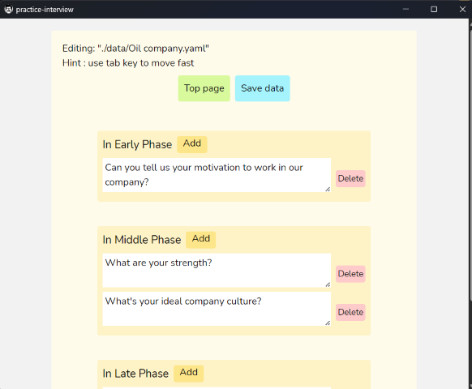
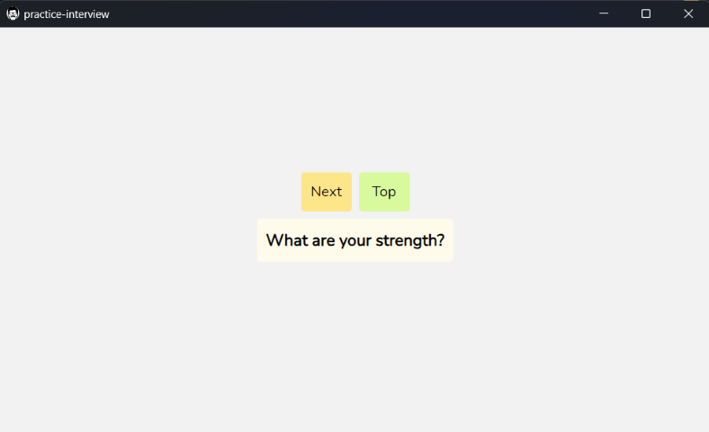

### Overview
An app to practice interview!\
In a job hunt interview, preparation for questions is necessary.\
This tool helps you to memorize your thoughts for future interview.

### Usage
For now, this tool is only for Windows.
1. Download `practice-interview.exe`.
2. Make a new folder.
3. Move the file into it.
4. Click and start.

### Demo
Make different questions for each company.\


Edit questions in early, middle, and late phase in the interview.\


Do a role play as an interviewee.\


### Settings
This tool works following folder settings.\
This .exe file create a folder named data.\
Before using this tool, create a new folder and put .exe file into it.
```bash
practice-interview.exe
data
  └-company1.yaml
  └-company2.yaml
  └-company3.yaml
```


